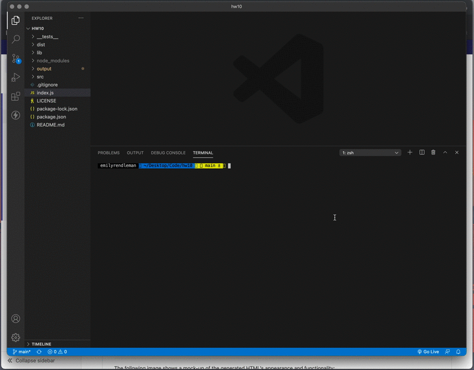
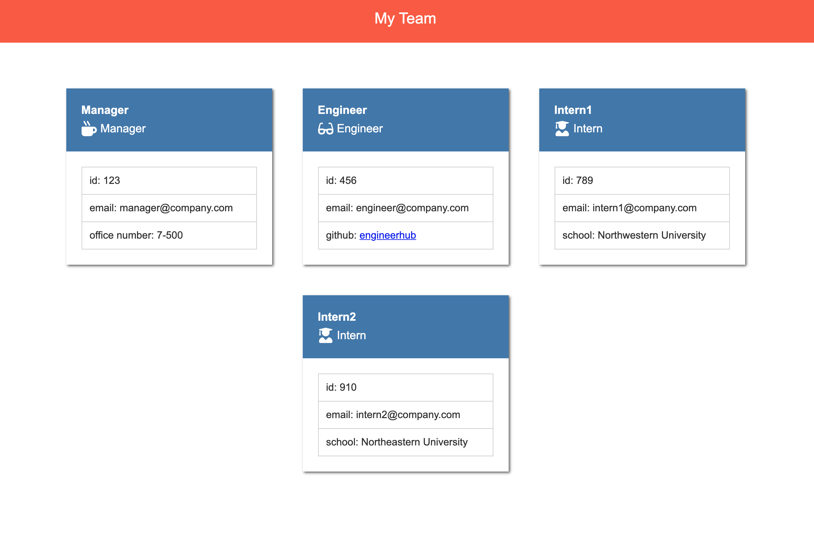

# TeamProfileGenerator [](https://opensource.org/licenses/MIT)

## Description
This project was designed to make team profile building easier by dynamically generating the team profile through command line prompts. 

## Table of Contents
1. [Installation](#Installation)
2. [Usage](#Usage)
3. [Contributing](#Contributing)
4. [License](#License)
5. [Tests](#Tests)
6. [Questions](#Questions)

## Installation
This project requires Node.js, Inquirer, and Jest. The user will need to install the npm packages by running ```npm i``` in terminal. 

## Usage
Once the user has installed the necessary dependencies, the index.js file can be run in terminal using Node. This provides the user with prompts for each employee type, or the user can exit the application by selecting "I'm done with the team". The user's answers are used to generate an HTML file that serves as the team profile.

.
.

## Contributing
This project was created jointly with our class instructor, Scott Brunswig (sbrunswig).

## License
The MIT License (MIT)

Copyright (c) 2021 Emily Rendleman

Permission is hereby granted, free of charge, to any person obtaining a copy of this software and associated documentation files (the "Software"), to deal in the Software without restriction, including without limitation the rights to use, copy, modify, merge, publish, distribute, sublicense, and/or sell copies of the Software, and to permit persons to whom the Software is furnished to do so, subject to the following conditions:

The above copyright notice and this permission notice shall be included in all copies or substantial portions of the Software.

THE SOFTWARE IS PROVIDED "AS IS", WITHOUT WARRANTY OF ANY KIND, EXPRESS OR IMPLIED, INCLUDING BUT NOT LIMITED TO THE WARRANTIES OF MERCHANTABILITY, FITNESS FOR A PARTICULAR PURPOSE AND NONINFRINGEMENT. IN NO EVENT SHALL THE AUTHORS OR COPYRIGHT HOLDERS BE LIABLE FOR ANY CLAIM, DAMAGES OR OTHER LIABILITY, WHETHER IN AN ACTION OF CONTRACT, TORT OR OTHERWISE, ARISING FROM, OUT OF OR IN CONNECTION WITH THE SOFTWARE OR THE USE OR OTHER DEALINGS IN THE SOFTWARE.

## Tests
Tests can be found in the __tests__ folder. 

## Questions
Reach out to me at emilyrendleman@gmail.com if you have questions about this project. 
You can explore more of my projects at https://github.com/emrendle.
